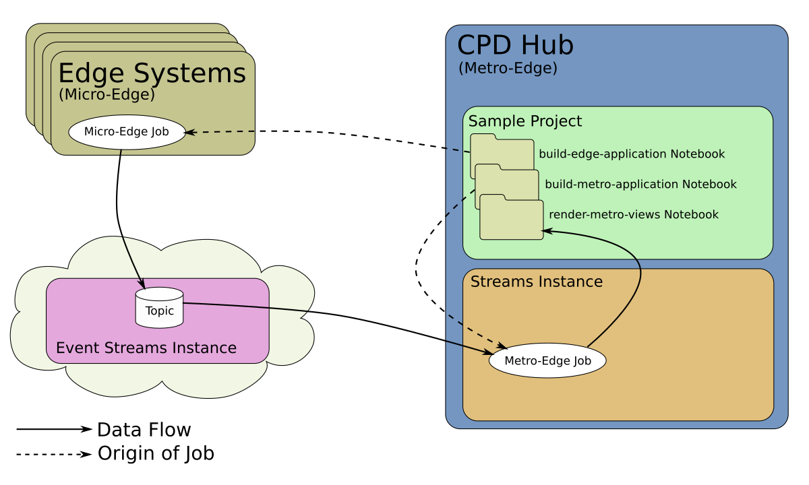

# sample.edge-mnist-notebook

This sample demonstrates the use of a Streams Python Notebook, and Edge Analytics in
Cloud Pak for Data, to recognize digit images using a simple scikit-learn ML
model trained with the standard MNIST digit dataset.  The ML model scores data right at
the micro-edge, but sends back metrics and low-confidence predictions to the CPD hub for
later analysis.

## Requirements

This sample requires Cloud Pak for Data (CPD) and several CPD services: Streams, Watson Studio,
and Edge Analytics.  A Streams Instance should be provisioned, and Edge systems should be
available. It also requires read/write access to an IBM Event Streams topic, accessible
to the CPD Streams Instance, as well as the Edge systems.

Please see the appropriate documentation links for installing and provisioning each item.

1. [IBM Cloud Pak for Data 3.0.1](https://www.ibm.com/support/producthub/icpdata/docs/content/SSQNUZ_current/cpd/install/install.html)
2. [Edge Analytics beta service on CPD](https://www.ibm.com/support/knowledgecenter/SSQNUZ_3.0.1/svc-edge/install.html)
3. [IBM Streams 5.4.0 service on CPD](https://www.ibm.com/support/producthub/icpdata/docs/content/SSQNUZ_current/cpd/svc/streams/install-intro.html)
4. [Watson Studio service on CPD](https://www.ibm.com/support/producthub/icpdata/docs/content/SSQNUZ_current/wsj/install/install-ws.html)
5. [Streams Instance](https://www.ibm.com/support/producthub/icpdata/docs/content/SSQNUZ_current/cpd/svc/streams/provision.html#provision)
6. [Edge systems](https://www.ibm.com/support/knowledgecenter/SSQNUZ_3.0.1/svc-edge/admin.html)
7. [IBM Event Streams instance on IBM Cloud](https://github.ibm.com/PrivateCloud-analytics/cp4d.edge/wiki/Kafka-Options-for-Edge-Applications#event-streams-in-ibm-cloud)

## Architectural Overview

The sample consists of three primary notebooks:
- `build-edge-application` creates the micro-edge application.
- `build-metro-application` creates and submits the metro-edge application.
- `render-metro-views` displays live information from the metro-edge application.

When running on the Edge systems, the *micro-edge application* iterates through a set of test images,
preparing and scoring them against a digit prediction model.  It sends aggregated metrics and
low-certainty images to a topic in Event Streams, which are then picked up by the *metro-edge application*,
running on the CPD Hub in a Streams instance, where metrics can be aggregated across multiple micro-edge
application instances.

A notebook running in the CPD Hub can be used to see data from the metro-edge application, in real-time,
displaying dashboards of current digit prediction statistics, uncertain digit prediction images and
scores, and a mocked-up "Correction Station", which could be used to re-train the prediction model
to improve accuracy, etc.

## Instructions

### 1. Import the Sample into CPD as a Project

In order to try out the sample, you need to first import it into CPD as a new Project.
When you [create the Project](https://www.ibm.com/support/knowledgecenter/SSQNUZ_3.0.1/wsj/getting-started/projects.html),
you can [import](https://www.ibm.com/support/knowledgecenter/SSQNUZ_3.0.1/wsj/manage-data/import-project.html)
directly from the `sample.edge-mnist-notebook` Github repository.  Further documentation for creating a project and
integrating with Github is available [here](https://www.ibm.com/support/knowledgecenter/SSQNUZ_3.0.1/wsj/manage-data/git-integration.html).

### 2. Build and Deploy Micro-Edge Application
1. Open the `build-edge-application.jupyter-py36` notebook in CPD.
2. Be sure the Streams Instance name (`STREAMS_INSTANCE_NAME`) and the Event Streams topic (`EVENTSTREAMS_TOPIC`) are set
   appropriately to match your environment (Requirements 6 and 7, respectively, above).
3. Execute each cell in the notebook.
   - Be sure to enter your Event Streams credentials string in the third code cell when it prompts.  This should have
     been acquired while setting up the Event Streams instance, above in Requirement 7.
4. The last cell submits the build request and waits for the application image to finish building, which might take a while.
   - After successful completion, the application container image is available in the configured CPD Docker registry, with
     the image name `edge-camera-classifier-app:v1`.
5. After building the image, it needs to be [packaged for deployment](https://www.ibm.com/support/knowledgecenter/SSQNUZ_3.5.0/svc-edge/usage-register-app.html),
   either directly in CPD or in Edge Application Manager.
6. Finally, it can be [deployed to edge systems](https://www.ibm.com/support/knowledgecenter/SSQNUZ_3.5.0/svc-edge/usage-deploy.html).
7. Optionally, after the appliction is running on one or more edge systems, the `testing-kafka.jupyter-py36` notebook
   can be used to directly view the messages the micro-edge application is writing to the Event Streams topic, for debug.
   - When running the cells in this notebook, be sure the `EVENTSTREAMS_TOPIC` is set appropriately, and enter the Event
     Streams credentials string when prompted, as above.  Note that by default, only the aggregated digit prediction and
     scoring performance metrics will be shown.  If `SHOW_IMAGES` is set to True, the image associated with each low-
     confidence prediction will be displayed, along with the possible predictions and their scores.  Interspersed with these
     images, the occasional metrics information will be displayed, each time it is sent across the topic.

### 3. Build and Submit Metro-Edge Application
1. Open the `build-metro-application.jupyter-py36` notebook in CPD.
2. Be sure the Streams Instance name (`STREAMS_INSTANCE_NAME`) and Event Streams topic (`EVENTSTREAMS_TOPIC`) are set
   appropriately to match your environment, as above.
3. Execute each cell in the notebook.
   - Be sure to enter your Event Streams credentials string when it prompts, as above.
4. The last cell submits the build request and waits for the application to finish building.  Once it has finished, it
   submits the application as a job in the local CPD Streams Instance (that is, _not_ on an Edge system).
   - The running job can be viewed or cancelled via the CPD "My Instances" interface, under the "Jobs" tab.

### 4. Observe Running System
Once both applications are up and running, the micro-edge application will be sending occasional aggregate performance
and prediction metrics up to the metro-edge application, along with images that it had a difficult time predicting the digit in
(that is, low confidence in its prediction).  While the metro-edge application could perform some additional analytics or
action on those images and metrics, across all instances of the micro-edge application, the current metro-edge application
just aggregates them and exposes them as Streams Views so that local notebooks can perform interactive analysis of the
current behavior.  The `render-metro-views` notebook is an example of this.
1. Open the `render-metro-views.jupyter-py36` notebook in CPD.
2. Be sure the Streams Instance name (`STREAMS_INSTANCE_NAME`) is set appropriately to match your environment, as above.
3. Execute the cells in the notebook.
   -  While the early cells simply set up the Streams View connection queues, the last three sections are more notable,
      and probably should be executed one at a time, reading the description and interacting with the graphs and images as
      described in the notebook.

